# core-v-mcu-cli-test
Repository of Command-Line-Interface test routines for the CORE-V MCU.

Core-v-mcu-cli-test is a stand-alone program that runs on the CORE-V MCU under FreeRTOS and is controlled from a terminal.
At the time of this writing (2022-03-09) "cli-test" runs under Verilator or in emulation on a Digilent Nexys A7-100T evaluation kit.
Setup instructions for the Nexys A7 and a terminal emulator to run cli-test can be found in the [CORE-V-MCU Quick Start Guide](https://github.com/MikeOpenHWGroup/core-v-mcu/blob/qsg/emulation/quickstart/README.md).

It is expected that the majority of cli-test users will want to run it from an Integrated Development Environment.
The remainder of this document will get you set up with the **Eclipse-IDE**.

### Emulation bitsream
Bitsreams compatible with the Nexys A7-100T can be found at:
http://downloads.openhwgroup.org/
Follow the instructions provided in the CORE-V MCU Quick Start Guide to load the bitstream.

### Eclipse IDE Installation
The Eclipse IDE relies on a larger ecosystem of tools and these instructions assume you are familar enough with the Eclispe IDE environment to make any required configuration changes to the IDE setup.

### Step 1:
Download and install the approriate corev-gcc toolchain from
~~~
https://www.embecosm.com/resources/tool-chain-downloads/#corev
~~~

### Step 2:
Download and install the **Eclipse IoT Embedded CDT IDE** (this will eventually be replaced by a pre-configured CORE-V IDE based on the Eclipse IDE tools).  
~~~
https://projects.eclipse.org/projects/iot.embed-cdt/downloads
~~~

### Step 3:
Install OpenOCD.  Recommend getting it from this location:
~~~
https://sourceforge.net/projects/openocd/files/openocd/
~~~
Version 0.11.0-rc2 is know to work with this setup.

Installation is accomplished by:
~~~
./configure --enable-ftdi && make
sudo make install
~~~

### Step 4: run the Eclipse IDE and import projects directly from this OpenHW git repo

NOTE: importing the cli_test project into the IDE does not import the information to launch the debugger, so after importing cli_test, be sure to either import the launch configuration (below in Step 5) or create your own.

#### Step 4.1: Launch Eclipse
~~~
eclipse
~~~

#### Step 4.2: From Welcome, select Import

#### Step 4.3: Select Import Projects from Git

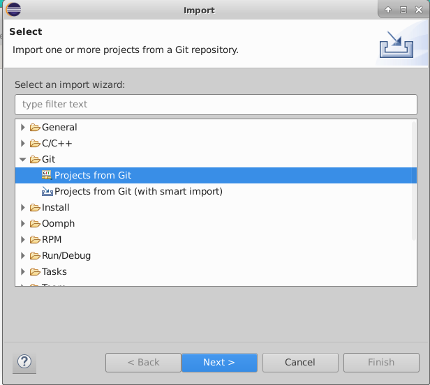

#### Step 4.4: Specify Clone URL

#### Step 4.5: Specify the Source Git Repository
Provide the full URL path to `core-v-mcu-cli-test`.

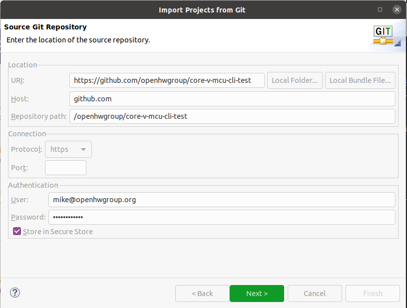

#### Step 4.6: Select the branch to clone
Note: the list of branches will change over time.
The `main` branch is stable, but not necessarily the latest.
All other branches are development branches and may not be stable.

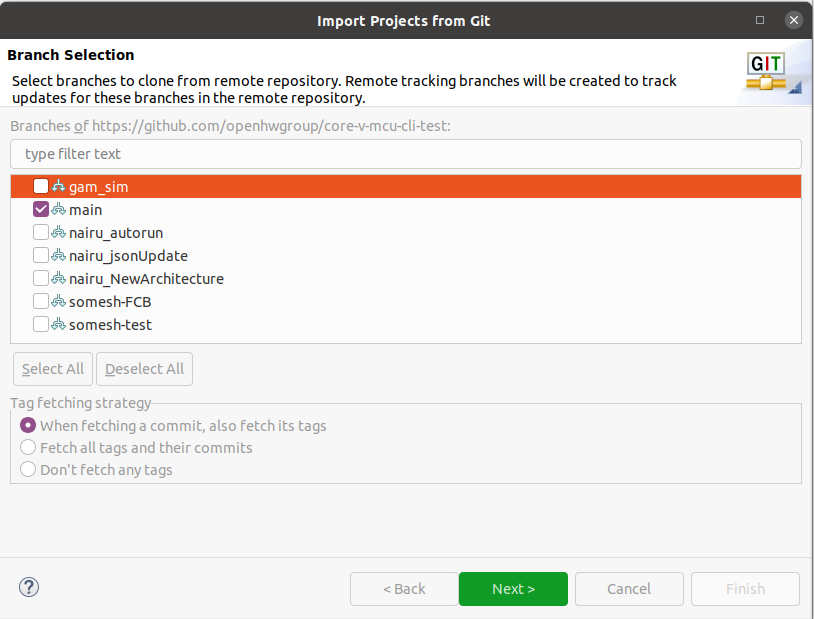

#### Step 4.7: Specify directory for git to use (use the default)

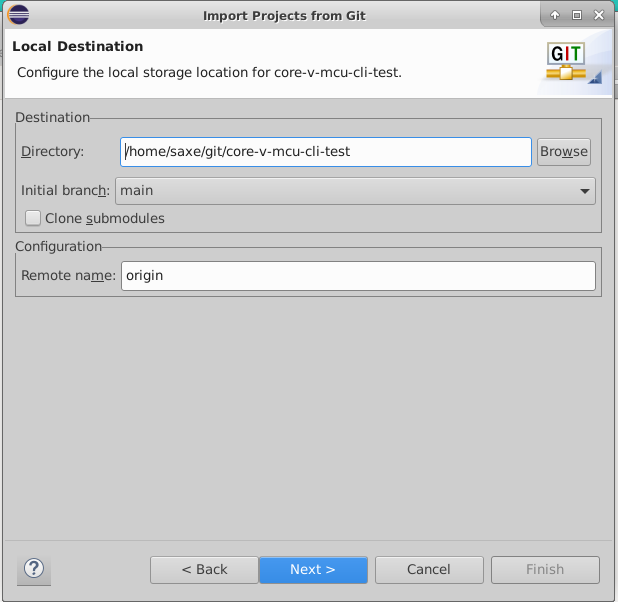

#### Step 4.8: Select which Wizard to use for import

#### Step 4.9: Select projects to import
`cli_test` is the only one you need.

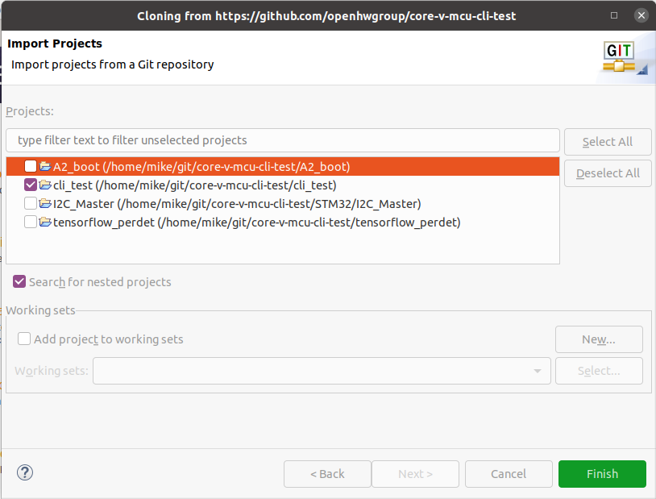

#### Step 4.10: Select 'Finish'
You should see something like this after selecting 'Finish'.

### Step 5: Configure the Toolchain
This step configures Eclipse so that it finds the CORE-V toolchain that was downloaded and installed in **Step 1**.

In the Eclipse Project Explorer select the `cli_test` Project, right click and select `Properties` (typically appears at the bottom of the pop-up menu).
Select `C/C++ Build / Settings` to bring up the window below:

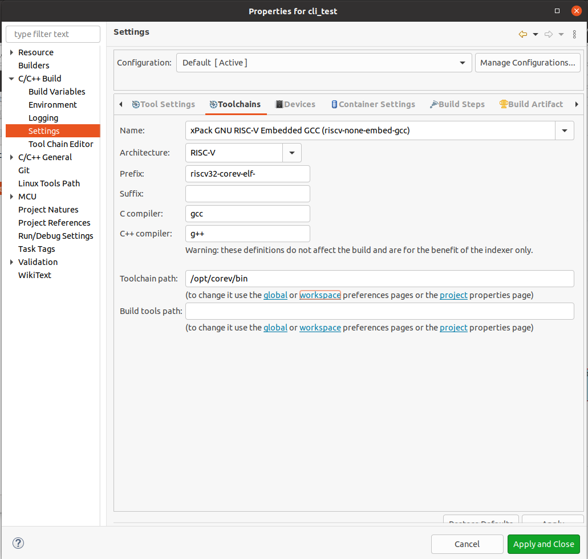

In this example, the `Toolchain path` was changed by selecting the `workspace` preference page.
This brings up the "Workspace RISC-V Toolchains Paths" preferences selection window.
Update the Toolchain folder to point to your install path.

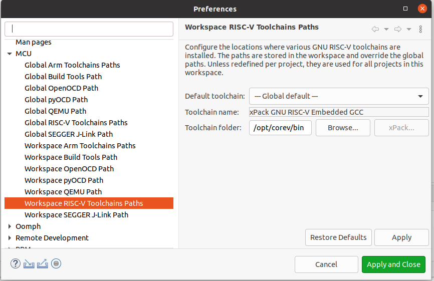

### Step 6: Compile cli_test
Assuming everything above has completed this step is simplicity itself.
With `cli_test` selected in the Project Explorer pane, click on Build (the hammer icon):

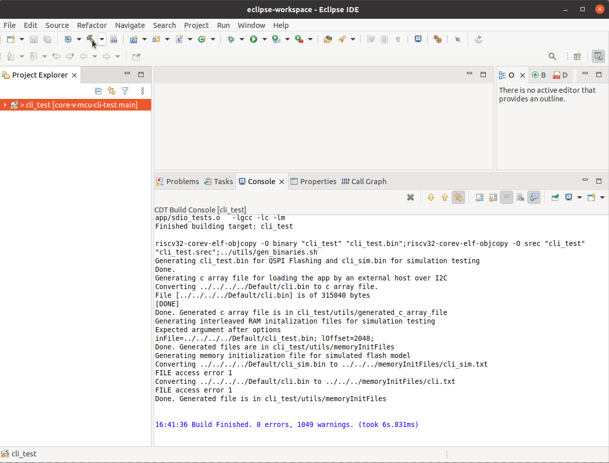

### Step 7: Import launch configuration

This step pulls in the launch configurations which are configured to use **OpenOCD** and the [JTAG-HS2](https://digilent.com/shop/jtag-hs2-programming-cable/) programmer.
Reminder: the instructions for connecting the HS2 to the Nexys A7 can be found in the CORE-V-MCU Quick Start Guide (a link can be found at the top of this README).

If your hardware setup is different, you can either ignore this step and create your own, or use this step and modify to fit your configuration.

#### Step 7.1:
Select 'File' and then 'Import...'.

#### Step 7.2:
Select 'Run/Debug' and then 'Launch Configurations'.

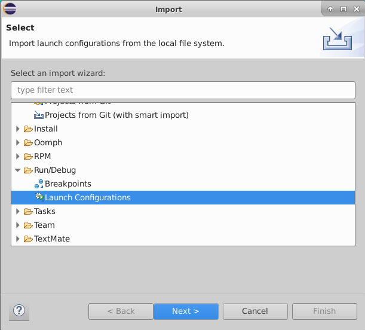

#### Step 7.3:
Here you will fetch the HS2 launch configuration from your clone of core-v-mcu-cli-test repository.
In the `core-v-mcu-cli-test` repo there is a set of launch configurations in the `launch` directory.
Use the `Browse...` button to navigate to the git directory that was chosen as the 'Local Destination' in **Step 4.7** and then `launch`.

Select 'launch' and 'cli_test hs2.lauch'.

#### Step 7.5:
Under the `Run` menu select `Debug Configurations...`

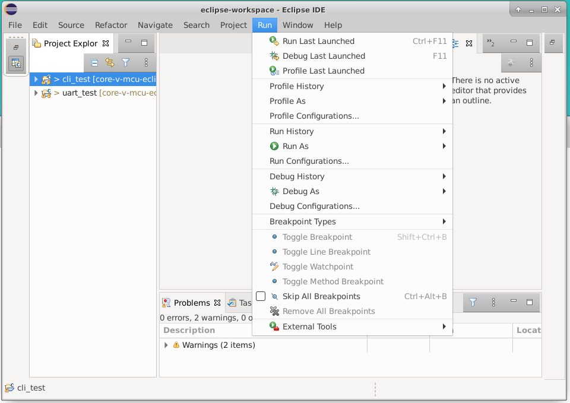

#### Step 7.6:
Under `GDB OpenOCD Debugging` select `cli_test Default` and then `Debug`.

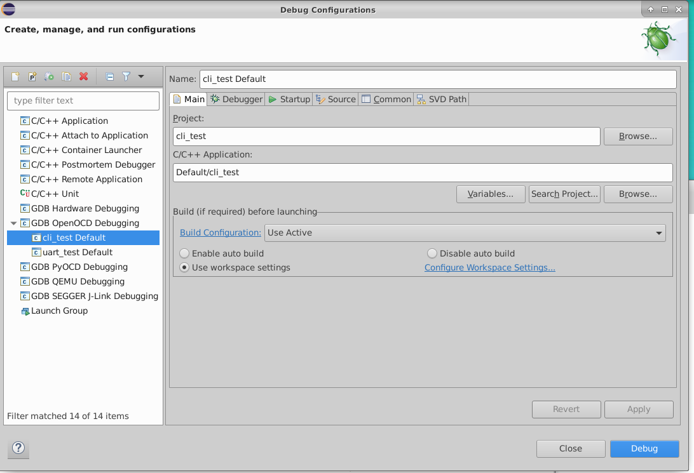

This should compile, link and load the application and stop at main waiting for you to start debugging.

## Peripheral support
The type and number of peripherals supported are defined by `pulp_soc_defines.sv`.
The information is made available to software applications as a series of #define values in the 'SOC options' section of 'target/core-v-mcu/include/core-v-mcu-config.h'.
An example configuration is:
~~~
// SOC options
#define N_IO                 48         // Total available IO
#define N_SYSIO              3
#define N_GPIO               32
#define N_UART               2          // Number of uarts
#define N_QSPIM              1          // Number of QuadSPI masters
#define N_I2CM               2          // Number of I2C masters
#define N_I2SC               0
#define N_CSI2               0
#define N_HYPER              0
#define N_SDIO               0
#define N_CAM                1
#define N_JTAG               0
#define N_MRAM               0
#define N_FILTER             1
#define N_FPGA               1
#define N_EXT_PER            0
#define N_EFPGA_TCDM_PORTS   4
#define N_FPGAIO             43
#define N_EFPGA_EVENTS       16
~~~
